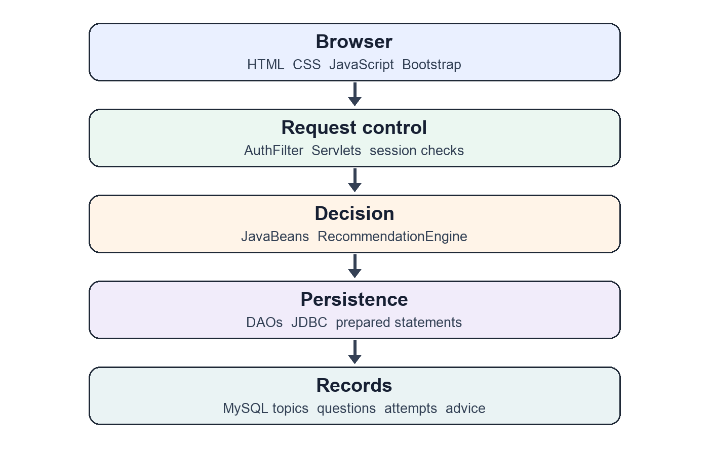
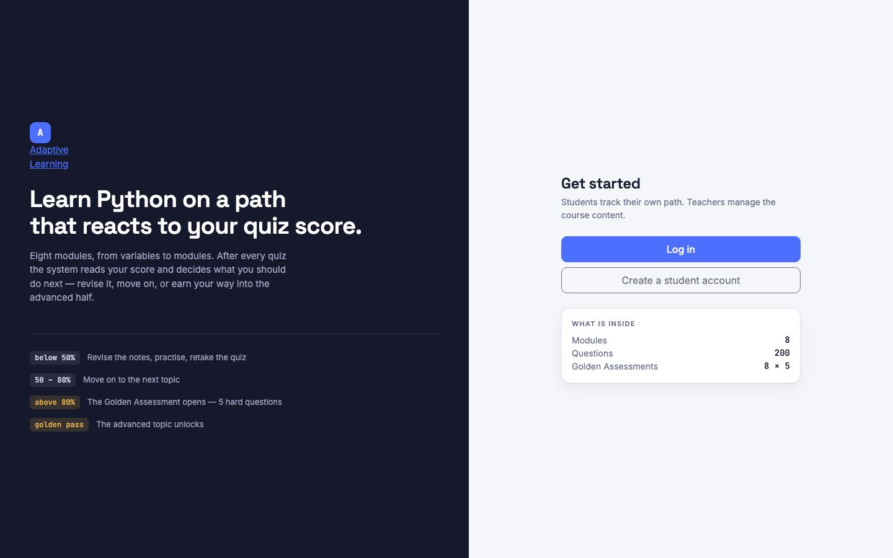

# ADAPTIVE PERSONALISED LEARNING PATH RECOMMENDER

**Project Based Learning Report — Web Technologies**

**Python Programming course demonstrator**

**Woxsen University, School of Technology**
**Department of Computer Science and Engineering**
**B.Tech Computer Science and Engineering, Second Year**
**Academic year:** 2026–27
**Course code:** ____________________
**Semester:** III
**Section:** Panthers

**Submitted by (in the order supplied):**

| Student | Register number |
|---|---|
| M Shreevenkat Sathvik | 25WU0101168 |
| N Siddharth | 25WU0102263 |
| S Dhanush | 25WU0101139 |

**Under the guidance of:** Prof. Veeresh Biradar
**Date:** 29 September 2026

---

## Declaration

We, M Shreevenkat Sathvik (25WU0101168), N Siddharth (25WU0102263) and S Dhanush (25WU0101139), declare that this report describes our Project Based Learning work titled **Adaptive Personalised Learning Path Recommender**. We have identified the external research and software documentation used. The implementation and verification claims are limited to the evidence described in this report. This work has not been submitted for another academic award to the best of our knowledge.

**Place:** Hyderabad, Telangana
**Date:** ____________________

| Student | Signature |
|---|---|
| M Shreevenkat Sathvik — 25WU0101168 | ____________________ |
| N Siddharth — 25WU0102263 | ____________________ |
| S Dhanush — 25WU0101139 | ____________________ |

## Certificate

This is to certify that the project titled **Adaptive Personalised Learning Path Recommender** has been carried out by M Shreevenkat Sathvik (25WU0101168), N Siddharth (25WU0102263) and S Dhanush (25WU0101139), second-year B.Tech Computer Science and Engineering students of the School of Technology, Woxsen University, during the academic year 2026–27 under the guidance of Prof. Veeresh Biradar. The report describes the demonstrable minimum viable product verified on 29 September 2026.

**Guide:** Prof. Veeresh Biradar

| Guide signature | Head of Department signature |
|---|---|
| ____________________ | ____________________ |

## Acknowledgement

We thank Prof. Veeresh Biradar for guiding our Project Based Learning work. We also thank the School of Technology, Woxsen University, and the Department of Computer Science and Engineering for the opportunity to develop and present this Web Technologies project. We acknowledge the research authors and maintainers of the open documentation and software cited in this report.

## Abstract

Many learning sites send every learner to the same next lesson even when their quiz results show different needs. This project develops an adaptive learning path for an introductory Python course. It asks a practical Web Technologies question: can familiar browser, server and database components produce individual next-step guidance while keeping the decision explainable and enforceable? The completed minimum viable product gives each student a stored learning history and calculates the current action from assessment results.

A quiz score below 50% recommends revision; 50–80% permits progress to the next basic topic; above 80% also opens a five-question Golden Assessment. Passing Golden with at least 60% is required before the next advanced topic unlocks. Students can read notes, practise, take assessments, review advice and inspect progress. Teachers can maintain topics and questions and inspect attempts and recommendations. The browser interface uses HTML, CSS, JavaScript and Bootstrap; JSP and Servlets manage pages and requests; JavaBeans and a plain Java rule engine calculate decisions; JDBC and MySQL preserve history; and Apache Tomcat runs the application.

The seeded demonstration contains eight topics and 200 questions. Verification included 44 rule checks, a transaction integration test, authenticated content maintenance checks and live student and teacher walkthroughs. These results establish that the local MVP workflow works as described; they do not measure learning gains or production-scale performance. The adaptation is deterministic and rule-based. It does not use machine learning or an external AI service. The report records the starting code state, changes made, architecture, decision rules, test evidence and limits so the work can be presented and examined.

**Keywords:** adaptive learning, rule engine, JSP, Servlets, JDBC, MySQL, Web Technologies.

## Contents

List of Figures
List of Tables
1. Introduction and problem definition
2. Objectives, scope and success criteria
3. Starting point and development record
4. Requirements and use cases
5. Literature review and design rationale
6. Technology and architecture
7. Data design and learning rules
8. Module implementation
9. Verification and results
10. Demonstration plan
11. Limitations and future work
12. Conclusion
References and appendices

## List of Figures

Figure 1. Request and decision layers
Figure 2. Local MVP landing page

## List of Tables

Table 1. MVP success criteria and evidence
Table 2. Work completed during the MVP pass
Table 3. Actors and use cases
Table 4. Related work and design choices
Table 5. Web application layers
Table 6. Database entities
Table 7. Assessment thresholds and actions
Table 8. Verification results

## 1. Introduction and problem definition

A fixed learning path sends all students through the same sequence regardless of whether they need revision or are ready for harder material. This project asks whether a conventional web application can recommend a useful next step after each assessment and enforce that path consistently. Introductory Python provides a clear course domain for a classroom demonstration.

The MVP solves three connected problems. It records assessments rather than relying on temporary browser scores. It explains the next action in language a learner can follow. It also checks topic access on the server, so a student cannot open a locked advanced topic by changing a URL. Dashboard, modules and progress screens use the same stored results.

“Personalised” here means a path that changes according to each student's own history. The rules are deterministic and explainable: students with the same results receive the same path state.

The problem is visible at three points in a conventional online course. First, a learner who has struggled can be sent to the next lesson without revising the prerequisite. Second, a learner who has already performed well may be forced through the same route without an optional challenge. Third, a teacher may see a final score but not the sequence of attempts or the reason a particular lesson became available. The project addresses these points with a stored result, a clearly stated recommendation and a server-checked access rule. It does not need a predictive model to do so: a small set of explicit thresholds is enough to demonstrate the workflow.

Python was selected as the course subject because introductory topics have a natural order. Variables, Conditions, Loops and Functions form the basic path; OOP, Files, Exception Handling and Modules form the advanced path. The actual software architecture remains a Java web application. This separation is useful in a Web Technologies course: Python is the content that a student studies, while HTML, CSS, JavaScript, JSP, Servlets, JDBC, MySQL and Tomcat implement the learning platform. The distinction also makes the project understandable to reviewers who want to see how ordinary web components support apparently sophisticated personalisation.

## 2. Objectives, scope and success criteria

The primary objective is a presentable student and teacher workflow. A student must be able to register or sign in, see modules, study a topic, take a quiz, receive advice and inspect historical progress. A teacher must be able to sign in, manage topics and questions, and inspect activity. Retakes must preserve history while the best results drive access to new topics.

The objectives are observable rather than aspirational. For students, success means that a completed assessment produces one saved attempt and one saved recommendation, and that the new dashboard agrees with the result. For teachers, success means authenticated topic and question maintenance plus readable activity history. For the system, success means consistent boundary decisions at 49/50, 80/81 and 59/60 percent, as well as a stable result when a page is refreshed or a form is submitted twice. The verification chapter maps these objectives to specific checks.

The scope is one Python course, not a general learning management system. The seed course has four basic topics (Variables, Conditions, Loops and Functions) and four advanced topics (OOP, Files, Exception Handling and Modules). Each topic has ten practice, ten quiz and five Golden questions. Across eight topics that is 80 practice, 80 quiz and 40 Golden questions: 200 total. Practice is self-checking and unscored.

**Table 1. MVP success criteria and evidence**

| Success criterion | MVP evidence |
|---|---|
| Student receives a next step after an assessment | Live assessment submission and recommendation page |
| Topic access follows the published rules | 44 rule checks and live path inspection |
| Retakes preserve history | Append-only attempts; student and teacher history screens |
| Attempt and advice stay paired | Transaction integration test for commit and rollback |
| Teacher can maintain content and inspect activity | Temporary topic/question create, edit and delete through authenticated HTTP; activity pages render |
| Local presentation can run | Tomcat served the app and both demo roles signed in |

## 3. Starting point and development record

At the start of the completion pass, the workspace already contained Java source, JSP screens, styles and scripts, SQL schema and seed data, a build script, and 37 passing rule tests. The local database held the eight-topic course and demo accounts. The starting folder had no Git metadata, so an earlier commit-by-commit history could not be reconstructed. The public Git repository was created after the MVP completion work. This starting point is the state directly observed during the pass.

The review found gaps that mattered for a reliable demonstration. Quiz and Golden endpoints could be mixed, repeated POSTs could duplicate results, and attempt and recommendation rows could be written separately. Some high-score advice implied a basic next topic was still locked. The student dashboard could show an old optional Golden recommendation as the main action while a later topic needed revision. The home page also understated the question count.

**Table 2. Work completed during the MVP pass**

| Area | Work completed | Effect |
|---|---|---|
| Login session | Replaced the old session after successful sign-in | Role switching begins with a clean session |
| Assessment routing | Matched each POST to the active topic and assessment type | Wrong endpoint cannot score the assessment |
| Duplicate handling | Serialized submission on the session and consumed active assessment | Repeat POST does not create duplicate rows |
| Question availability | Required all ten quiz or five Golden questions | Published score thresholds remain meaningful |
| Persistence | Wrote attempt and advice in one JDBC transaction | Both commit or both roll back |
| Advice | Corrected high-score wording for an already-open basic topic | Message agrees with unlock logic |
| Dashboard | Derived primary next step from current path state | Rahul is directed to OOP revision |
| Home page | Corrected total to 200 questions | Display matches seed data |
| Access and lifecycle | Added no-store private responses and MySQL shutdown cleanup | Reduced stale-page and reload issues |
| Database and tests | Expanded recommendation text and added checks | Longer advice persists; 44 checks pass |
| Public source preparation | Moved database settings to environment variables and excluded generated binaries | GitHub checkout contains source, documentation and a safe configuration example |

The completion work proceeded in five practical stages. The first stage inventoried source files, SQL scripts, seeded data and existing tests. The second traced the student and teacher routes to find what was already usable and what could fail during a demonstration. The third strengthened assessment validation, transaction handling and the next-step calculation. The fourth verified the corrected rules, database behaviour and visible pages. The fifth organised the source, setup instructions and report for a public GitHub repository. Because the earlier folder did not contain a recoverable commit history, this account describes the starting state observed in the workspace rather than attributing each original file to a particular contributor or date.

This record matters to an evaluator because the MVP was completed from an existing implementation, not conceived as a new blank project in the final pass. The core course model and most screens already existed. The changes concentrated on consistency, reliability and clear presentation: a student should receive a recommendation that matches the same rule used to unlock content, a teacher should see saved evidence, and a reviewer should be able to run the project from the published instructions. The distinction between pre-existing work and the completion pass is retained throughout this report.

## 4. Requirements and use cases

### 4.1 Functional requirements

The student interface supports registration, role-specific login, a dashboard, an ordered module path, notes, two levels of practice, scored quizzes, Golden Assessments, recommendations and attempt history. A student can mark advice as completed, but that personal status is separate from computed unlock state. The teacher interface shows course and activity totals, lets a teacher add or edit topics and questions, and lists all attempts and recommendations. Topics with student attempts cannot be deleted through the teacher page.

### 4.2 Non-functional requirements

The MVP runs locally in a browser with responsive layout. Server-side scoring is authoritative: correct answers remain in server-side assessment state and posted forms supply selected options. Data access uses prepared statements. A Servlet filter restricts student and teacher routes by role; authenticated responses carry no-store cache headers. The request flow remains understandable without an application framework.

### 4.3 Actors and use cases

**Table 3. Actors and use cases**

| Actor | Entry point | Main actions | End state |
|---|---|---|---|
| Visitor | Landing page | Register or sign in | Student or teacher session |
| Student | Dashboard | Study, practise, assess, read advice, inspect progress | New attempt/advice and recalculated path |
| Teacher | Teacher dashboard | Maintain content and inspect activity | Updated course or observed learning history |

A typical student sequence is to sign in, open the current topic, read notes, practise, take the ten-question quiz, view the score and advice, then revise, continue to an open basic topic or attempt Golden. Golden is available only after a best quiz score above 80% on that topic.

## 5. Literature review and design rationale

Adaptive hypermedia research describes how a system can use a learner model to change navigation and content [1]. Brusilovsky later placed such methods in the context of web-based educational systems and described adaptation as a relationship between learner information, educational content and system behaviour [2]. Our project uses a deliberately small learner model: best quiz score, best Golden score and attempt history for each ordered topic. It adapts navigation and recommendations, not the underlying lesson text. This narrower design is feasible for a semester MVP and easy to explain during a demonstration.

Drachsler, Hummel and Koper studied recommender requirements for lifelong learning networks [3]. Their work concerns broader, changing learning networks, whereas this project recommends a next action inside a fixed eight-topic course. The comparison helps define the boundary of our system: it is a rule-based path recommender, not a general resource recommendation platform. The ordered prerequisite path also means that a recommendation must agree with access checks; a message alone cannot be treated as an unlock.

Feedback research informs the form of the result page. Hattie and Timperley discuss feedback in relation to where a learner is going, how they are doing and what to do next [4]. Shute reviews formative feedback and the value of information that helps learners change their work [5]. Accordingly, the MVP pairs a numerical score with a rule explanation and an action such as revise, move ahead or attempt Golden. It records that advice so a student or teacher can inspect it later. The report does not claim the quality or educational effect of this feedback has been evaluated with learners.

VanLehn compared human tutoring, intelligent tutoring systems and other tutoring approaches [6], while Kulik and Fletcher reviewed evidence on the effectiveness of intelligent tutoring systems [7]. Those studies motivate interest in responsive instruction, but their outcomes cannot be transferred to this application. Our MVP does not model individual misconceptions, conduct dialogue or measure achievement improvement. Its contribution is the implementation and verification of a transparent classroom web workflow.

**Table 4. Related work and design choices**

| Related work | Relevant idea | Decision in this MVP | Scope difference |
|---|---|---|---|
| Brusilovsky [1], [2] | Adapt navigation using learner information | Best recorded results determine the visible path | No automated content adaptation |
| Drachsler et al. [3] | Learning recommendations need a learner context | Ordered topic and result history supply context | One fixed course, not an open resource network |
| Hattie and Timperley [4]; Shute [5] | Feedback should support a next action | Score, explanation and action are stored together | Feedback impact has not been studied |
| VanLehn [6]; Kulik and Fletcher [7] | Tutoring systems can be evaluated for learning | Test the software rules and workflow first | No tutoring dialogue or learning-gain trial |

The review therefore supports three design choices: keep decisions explainable, connect advice to recorded evidence, and avoid claiming an educational outcome that the MVP has not measured. The next chapters describe how simple Web Technologies implement those choices.

## 6. Technology and architecture

Ordinary web technologies provide the complete system. HTML structures pages. CSS and Bootstrap supply layout and responsive components [14]. JavaScript supports small browser interactions and validation. JSP renders server-prepared information [9]. Servlets receive requests, manage sessions, validate forms and redirect after writes [8]. JavaBeans and model objects hold data. A plain Java rule engine evaluates thresholds. DAOs use JDBC prepared statements [11] with MySQL [12], connected through Connector/J [13]. Tomcat runs the Servlet/JSP application [10].

**Table 5. Web application layers**

| Layer | Main files | Responsibility |
|---|---|---|
| Presentation | `web/*.jsp`, `web/css`, `web/js` | Show forms, learning path, scores and history |
| Controllers | `src/controller` | Receive requests, authorize and coordinate work |
| Business data | `src/beans`, `src/model` | Hold scores, topic state and page-ready values |
| Decisions | `src/engine/RecommendationEngine.java` | Select advice and topic access |
| Persistence | `src/dao`, `src/util/DBConnection.java` | SQL, transactions and connections |
| Runtime | MySQL, Apache Tomcat | Store records and serve the application |

**Request path:** Browser → Servlet and AuthFilter → JavaBeans/rule engine → DAO/JDBC → MySQL → JSP response. The browser does not decide scores or unlocks. Pages rebuild each student's path from ordered topics and recorded best quiz and Golden results. That simple server process produces personalised behaviour without training or calling a prediction model.

### 6.1 Responsibilities across the web stack

The browser is responsible for presentation and user input. HTML forms collect login details, selected quiz answers and teacher edits. CSS and Bootstrap make navigation, cards, tables and forms fit a laptop or phone screen; small JavaScript helpers improve interaction. These front-end elements can show a locked topic, but they cannot be the final authority for access. A visitor can alter a URL or POST body, so the Servlet checks the session role and recomputes the relevant topic state before starting an assessment.

The Servlet layer is the request coordinator. It reads validated parameters, locates the current user in the session, fetches course data through DAOs, asks the rule engine for a decision and selects a JSP response or redirect. This division means that the JSP is mainly a view and the rule engine is a plain Java class. The rules can therefore be tested without starting Tomcat, while the page can change appearance without changing the thresholds. The `AuthFilter` restricts routes to the correct role and private responses use no-store headers so a browser is less likely to show an earlier user's page after logout.

The persistence layer uses JDBC and a relational schema. A DAO hides SQL details from a Servlet. Questions, attempts and recommendations remain available after a process restart, unlike a browser-only prototype. Prepared statements bind student and topic identifiers as values instead of concatenating them into queries. The MySQL schema provides foreign keys between the student, topic and activity records. These modest tools are enough to create an auditable decision trail; the sophistication comes from coordinating them correctly.

### 6.2 Example request from answer to next action

Consider a student who has opened the Loops quiz. The GET request checks that Loops is unlocked, loads exactly ten quiz questions and stores that question set in the server session. The rendered form contains question identifiers and the student's selected options. The correct answers stay in the server-side question objects. On POST, the Servlet checks that the active session assessment is still the Loops quiz and belongs to that student. The `QuizBean` grades the submitted selections and produces a percentage. The rule engine receives the score, current topic and following topic, then returns a rule type, headline, explanation and access flags.

The DAO writes the attempt and recommendation within one database transaction. Only after that succeeds does the Servlet consume the active assessment and redirect to the result page. The result page can then show the newly generated advice without resubmitting the form on refresh. If the database write fails, the transaction rolls back and the assessment remains available for a retry. When the student opens the dashboard, the application recomputes path status from the stored best results rather than trusting a stale browser value. This request sequence is the central adaptive loop of the MVP.

### 6.3 Why the design is explainable

The recommendation is a rule outcome, not a statistical estimate. Each threshold corresponds to a named next action and can be demonstrated with an example score. The dashboard's current action is derived from the latest path state, so an earlier optional Golden opportunity does not hide a later topic needing revision. The distinction between latest advice and present path status is important: a saved recommendation is a historical record, while the main dashboard action should reflect what the student needs now. Retakes make this distinction visible because a later, better score can change access without erasing the earlier result.

The project uses the `jakarta.servlet` API and targets Tomcat 10.1 or 11 with JDK 17 or newer. MySQL Connector/J belongs in `web/WEB-INF/lib`. The build script compiles 38 Java sources and can deploy the web directory.

## 7. Data design and learning rules

### 7.1 Entity design

Six tables support the MVP. `students` and `teachers` hold separate account roles. `topics` stores ordered modules and notes. `questions` belongs to a topic and has PRACTICE, QUIZ or GOLDEN type. `attempts` records each scored assessment. `recommendations` records the advice generated for each attempt. Foreign keys connect activity to students and topics.

**Table 6. Database entities**

| Table | Key fields | Purpose |
|---|---|---|
| students | student_id, name, email, password | Student accounts and linked history |
| teachers | teacher_id, name, email, password | Teacher access |
| topics | topic_id, title, difficulty, topic_order, notes | Ordered course |
| questions | question_id, topic_id, question_type, correct_answer | Question bank |
| attempts | attempt_id, student_id, topic_id, type, score | Append-only scored history |
| recommendations | recommendation_id, student_id, topic_id, type, text, status | Advice history |

`database/01_schema.sql` defines the schema. `02_seed_data.sql` and `03_advanced_practice.sql` provide course content. `04_recommendation_text.sql` expands the advice field for an existing database without resetting it. The initial schema script drops and recreates the database and is for a fresh setup only.

The database separates course structure from student activity. A topic has a fixed order and a difficulty label; each question belongs to one topic and one assessment type. A scored attempt stores the score along with the number correct and number presented. This allows a teacher to interpret a score without assuming that all future assessments will have the same length. Recommendations have their own rows because advice is a visible historical output, not a temporary string derived only when the page loads. The recommendation status is a student's personal follow-up marker. It does not override the objective quiz and Golden thresholds.

There is no separate progress table. For each ordered topic, the engine asks for the student's best quiz, number of attempts and best Golden result. It carries the immediate previous topic's values to decide whether the next one opens. This reduces the chance of a stored `unlocked` flag drifting away from the evidence after a retake. The cost is more reads when a path is built; for an eight-topic classroom course that tradeoff is acceptable. A larger course would need profiling and probably a more efficient aggregate query or cached read model.

### 7.2 Scoring and decisions

Percentage equals correct answers divided by total questions, multiplied by 100. A quiz has ten questions; a Golden Assessment has five. The boundaries are deliberate: 50% passes a quiz, 80% remains in the middle band, 81% opens Golden, and three correct Golden answers give 60% and pass.

**Table 7. Assessment thresholds and actions**

| Assessment result | Rule | Advice and access |
|---|---|---|
| Quiz 0–49% | Below 50 | Revise, practise and retake; next topic stays locked |
| Quiz 50–80% | 50 through 80 | Next basic topic opens; advanced still needs Golden |
| Quiz 81–100% | Above 80 | Golden opens; next basic topic is already open |
| Golden 0–59% | Below 60 | Advanced practice and retry |
| Golden 60–100% | 60 or more | Next advanced topic may unlock |

The first topic is always open. A later basic topic needs at least 50% on its immediate predecessor's best quiz. A later advanced topic requires a passing quiz and passed Golden on its predecessor. These plain `if/else` rules live in `RecommendationEngine.java`. The UI shows locked, not started, needs revision, completed or mastered states.

An example makes the boundary precise. Suppose a student scores 8/10 on Functions. The result is 80%, so the quiz is passed, but Golden is not yet available because the rule says *above* 80%. If the student retakes Functions and scores 9/10, Golden becomes available. A Golden score of 2/5 is 40% and leaves the following advanced topic locked. A later Golden score of 3/5 is 60% and passes. Since the engine uses best results, the earlier failure remains in history while the later pass determines access. For a basic next topic, a quiz pass already opens it; Golden can still be an optional challenge and its message must say the basic topic is already open.

The same boundaries appear in two places: the result recommendation and the access rule. A test that checks only the text would miss a locked-page error, while a test that checks only access could allow misleading advice. The rule suite therefore checks both recommendation types and unlock states at the edges. At the final topic, where there is no following topic, the engine has separate wording for course completion and an optional Golden challenge rather than naming an unavailable destination.

### 7.3 Submission consistency

At assessment start, the server stores the question set in the session. A POST is accepted only for the matching assessment and topic. After submission, the active assessment is consumed, preventing a repeated POST from recording another attempt. The DAO inserts the attempt and advice in one SQL transaction; a failure rolls both back. Retakes append new rows. Best scores drive unlocks, while the full attempt sequence stays available.

This sequence addresses two forms of consistency. Session state ties the submitted answers to the exact questions presented to the student, which prevents a form from claiming a different topic or assessment type. Database transaction state ties the score to the advice shown for that score. A failed second insert should not leave an unexplained attempt. The integration test deliberately forces that failure and confirms that neither row is committed. These controls are small implementation details, but they make the learning history credible in a live demonstration.

## 8. Module implementation

### 8.1 Authentication and roles

Registration creates student accounts. Teachers use seeded accounts for the classroom demonstration. Successful login creates a fresh session; the student and teacher objects are distinct session attributes. `AuthFilter` checks protected routes so a visitor cannot simply request a dashboard URL and a teacher session cannot act as a student session. Logout invalidates the active session. These checks are server-side and independent of whether the navigation menu displays a link. Passwords currently use a SHA-256 digest; a slow salted password hash is a required improvement before any public service deployment.

### 8.2 Student dashboard, modules and topic pages

The dashboard reports completion, average best score, quizzes, Golden passes and a current actionable topic. It also shows the latest saved recommendation and a short recent-attempt list. Those are related but different views: the latest recommendation records what was said after an assessment, while the primary action is calculated from the present ordered path. This avoids sending the student toward an optional older Golden result when a later topic now needs revision.

The Modules page shows eight topics in their course order. A topic can appear locked, not started, needing revision, completed or mastered according to stored results. The first topic is open by default. Each later topic asks about its predecessor; basic topics need a passing quiz and advanced topics also need a passed Golden Assessment. A direct request to a locked topic or quiz is checked by the server again, so the card state is more than a cosmetic lock icon. The topic page presents notes, unscored practice and the available scored action. Advanced practice is the suggested route after a failed Golden attempt.

The seeded course acts as a compact dataset. Four basic and four advanced topics each provide ten practice, ten quiz and five Golden questions. Questions are separated by type so practice can be self-checking without affecting the progression record. The complete seed therefore has 80 practice, 80 quiz and 40 Golden questions. A teacher can extend content, but each scored assessment requires the specified number of available questions; this keeps the percentage bands meaningful.

### 8.3 Assessment and feedback pipeline

The quiz and Golden assessment have separate URLs and requirements. A quiz GET checks topic access and loads exactly ten quiz questions. A Golden GET checks that the student's best quiz score for that topic is above 80% and loads exactly five Golden questions. Both forms use `QuizBean` to grade the question set stored in the session. The submitted form carries selected option letters; skipped questions count as incorrect. The result is an integer percentage based on correct answers and total questions, then `RecommendationEngine` converts that percentage into advice.

At POST time, the Servlet rejects an absent, already evaluated, wrong-type or wrong-owner assessment. It rechecks the relevant topic access and uses a synchronized block on the session while recording the result. After a successful transaction, it removes the active assessment and redirects to the recommendation page. This protects the history from duplicate submissions caused by repeated POSTs and from sending a Golden form to the quiz endpoint or the reverse. A failed database save returns an error and resets the evaluated flag so the student can retry instead of silently losing the assessment.

The result page shows the percentage, a rule headline, an explanation and an action link. Recommendation history remains available later, and the student can mark an item done. The personal status is useful as a reminder, but the engine does not read it to unlock a topic. This separation prevents a click on “done” from becoming an accidental substitute for demonstrating mastery.

### 8.4 Teacher workspace and content maintenance

The teacher dashboard gives course and activity totals. The topic and question pages use forms for create and update actions and tables for existing content. A hidden action field selects the operation while a redirect after POST prevents a page refresh from repeating an edit. Server validation checks required fields, option values and identifiers. A topic with student attempts cannot be deleted through the teacher page; this protects the historical meaning of those attempts. When a topic without attempts is deleted, its questions are removed with it according to the database relationship.

The activity screens list attempts and recommendations across students. Attempt history includes retakes, not just the best score used by the path. Recommendation history shows the rule output, advice text, status and time. Together they allow a teacher to compare what happened, what the system advised and what the student can open now. This is particularly useful when explaining a rule-based system: the teacher can inspect a concrete record rather than taking the dashboard at face value.

### 8.5 Build and local deployment

The project uses a small shell build script rather than a large application framework. It compiles the Java source against the Servlet API, copies the web directory and can deploy to a local Tomcat instance. MySQL supplies the schema and demo data; Connector/J is placed in `WEB-INF/lib`. Database connection settings come from environment variables in the public repository, so credentials are not included in source control. The repository README names the required JDK, MySQL, Tomcat and Connector/J steps and provides demo accounts. This packaging keeps the project readable for a Web Technologies evaluator who wants to follow a browser request into a Servlet, a Java class and a SQL table.

## 9. Verification and results

Verification used local MySQL and an isolated Tomcat 11.0.25 instance on 29 September 2026. The rule suite compiled all 38 Java sources and passed 44 checks. The database integration test exercised a valid attempt-plus-advice commit and a forced recommendation failure that rolled both writes back. The expected foreign-key message in the negative case belongs to the rollback test. Live browser inspection covered landing/login, student dashboard/path/topic, teacher dashboard/content pages and both teacher activity histories. Authenticated HTTP form submissions created, edited and deleted a temporary topic and question; direct database checks confirmed each change and that the seeded content was restored afterward.

**Table 8. Verification results**

| Test | Expected outcome | Observed result |
|---|---|---|
| `./build.sh test` | Thresholds, unlocks and next action hold | 44 passed, 0 failed |
| `./build.sh integration-test` | Commit or roll back attempt and advice together | Passed |
| Visitor opens student dashboard | Authentication required | Redirected to login |
| Student login | Saved dashboard/path load | Passed |
| Old optional Golden result after later low quiz | Current low topic is primary action | Dashboard shows OOP revision |
| Quiz/Golden endpoint mismatch | Reject without recording | Passed live check |
| Repeated quiz POST | No duplicate rows | Passed live check |
| Perfect quiz | Golden available | Passed live check |
| Golden score 3/5 | 60% pass | Passed live check |
| Teacher login | Dashboard and content/activity pages load | Passed browser walkthrough |
| Teacher content maintenance | Add, update and delete temporary topic and question | Passed authenticated HTTP and database checks; temporary rows removed |
| Teacher session requests student route | Role boundary enforced | Redirected away |

The seeded Rahul account showed 11 recorded attempts, four completed quiz topics out of eight, five unlocked topics and OOP at 20% as the immediate revision action. Teacher screens showed the eight topics and seeded question bank. These demo counts change as content is edited or new assessments are submitted.

This verification supports the MVP workflow. It is not a load test, public-hosting readiness test or exhaustive accessibility audit. Teacher forms were visually inspected, and their create, update and delete actions were exercised through authenticated HTTP submissions rather than a complete mouse-driven UI cycle.

### 9.1 What the rule checks establish

The 44 checks cover the visible boundaries and the less obvious combinations behind them. A quiz score of 49% must advise revision, 50% must pass, 80% must remain in the middle band and 81% must offer Golden. A Golden score of 59% must not satisfy the pass rule, while 60% must. The tests also cover first-topic access, basic and advanced successors, a final topic with no successor, and the selection of a current action when historical recommendations and present path status differ. Since the rule engine is plain Java, these tests run without a browser and make the decision logic repeatable.

The tests do not prove every possible Servlet request or database state. That is why a separate integration test checks the two-row transaction and live checks exercise sessions, redirects and data maintenance. In the successful integration path, both an attempt and its recommendation appear. In the forced-failure path, the recommendation insert fails and the attempt is rolled back. The expected database error is evidence that the negative branch was triggered; the pass condition is the absence of a partially saved result.

### 9.2 Interpretation against the objectives

The student objective is met for the local MVP because a student can complete an assessment, receive a rule-based next action and see the saved attempt and advice in later pages. The teacher objective is met because authenticated pages show totals and histories and allow temporary content maintenance. The consistency objective is supported by rule tests at exact thresholds, endpoint-mismatch checks, repeated-POST checks and the transaction test. The public repository objective is met by including source, setup instructions, SQL scripts and this report rather than machine-specific credentials or generated binaries.

These are software-function results, not an educational impact study. No class of students was randomly assigned to compare learning gains, and no long-term usage measurements were collected. The report therefore describes the observed application behaviour and avoids a claim that students learn faster or achieve higher marks. Such a claim would require a separate study with suitable participants, measures and ethics approval.

## 10. Demonstration plan

1. Open the landing page and explain the four score rules and the eight modules.
2. Log in as `rahul@student.edu` with the demo fill button. Show OOP as the current revision task and the separate latest Conditions result.
3. Open Modules to explain basic/advanced access and Golden. Open OOP to show notes, practice, quiz action and progress.
4. Open Progress and Recommendations to show saved history.
5. Log out and log in as `anita.rao@college.edu`. Show teacher totals, topic and question bank pages, attempts and recommendations.
6. Explain the request path: forms reach Servlets, Java rules decide, JDBC saves to MySQL, and JSP presents the result.
7. State clearly that the MVP is adaptive and rule-based. No machine learning model is trained or called.

For a clean first-time path, use `sneha@student.edu` or register a new student. Demo passwords are in `README.md`. A live quiz changes account data, so use a throwaway registered account for a repeatable recorded demonstration.

## 11. Limitations and future work

The app meets its local classroom MVP scope. Its passwords use SHA-256 rather than a slow salted scheme. Teacher-authored notes render as HTML, and authenticated POST forms do not yet have CSRF tokens. Those points need attention before deploying the application as a public service. Database connection settings are read from environment variables rather than committed credentials. The interface is English-only; the course is a single seeded Python path; recommendation thresholds are fixed rather than teacher-configurable.

Future work could add secure account provisioning and configuration, CSRF protection, restricted teacher content, automated Servlet-level tests, accessibility review, teacher-adjustable thresholds, more courses and learning analytics. An ML recommender would be a separate research extension needing data and validation; it is not part of this MVP.

Before any public deployment, account security and content trust would take priority. Passwords should use a standard slow salted hash such as Argon2 or bcrypt. Teacher accounts should be provisioned without fixed demo credentials, and forms that change data should have CSRF protection. Teacher-authored notes should be sanitised or restricted to a safe format before being rendered as HTML. HTTPS, secure cookie settings, centralised error handling and operational backups would also be needed. These items are identified because the current project is a local classroom demonstration and has not been prepared as a service for real student data.

The learning design has deliberate limits. A fixed threshold does not reveal *why* a student missed a question; two students with the same score may need different explanations. The course contains one subject and a manually ordered path. The engine uses best scores to preserve progress after a later weaker retake, but it does not model forgetting or time since mastery. A future version could add learning objectives per question, topic-level diagnostics, teacher-adjustable thresholds and more courses. Those changes should keep access and advice consistent and should be tested with real usage before asserting a learning benefit.

The implementation can also be strengthened as a software product. A larger question bank would permit randomised forms; automated Servlet-level tests could cover more request validation and role cases; a structured deployment package and CI workflow could make fresh setup more repeatable. Accessibility checks with keyboard and screen-reader users are needed beyond the visual walkthrough. Performance profiling would be appropriate only after course and user counts grow beyond the eight-topic local seed. These next steps are concrete extensions of the observed MVP rather than features claimed as complete.

## 12. Conclusion

The completed MVP demonstrates that familiar Web Technologies can create a personalised learning path. Server-side scores, a small explainable rule engine and relational history provide meaningful next-step guidance and enforce the advanced-topic gate. Student and teacher journeys run locally, 44 rule checks pass, and the transaction test confirms that each attempt stays paired with its advice. The system is ready for classroom presentation, with public-deployment work identified separately.

## References and appendices

The citations below refer to the original research papers, official platform documentation and the public source repository. The software documentation was consulted on 29 September 2026. The seven research sources provide background and design rationale; they do not constitute an evaluation of this MVP's learning outcomes.

[1] P. Brusilovsky, “Methods and techniques of adaptive hypermedia,” *User Modeling and User-Adapted Interaction*, vol. 6, no. 2–3, pp. 87–129, 1996. doi: 10.1007/BF00143964.

[2] P. Brusilovsky and C. Peylo, “Adaptive and intelligent web-based educational systems,” *International Journal of Artificial Intelligence in Education*, vol. 13, no. 2–4, pp. 159–172, 2003. doi: 10.3233/IRG-2003-13(2-4)02.

[3] H. Drachsler, H. G. K. Hummel and R. Koper, “Personal recommender systems for learners in lifelong learning networks: The requirements, techniques and model,” *International Journal of Learning Technology*, vol. 3, no. 4, pp. 404–423, 2008. doi: 10.1504/IJLT.2008.019376.

[4] J. Hattie and H. Timperley, “The power of feedback,” *Review of Educational Research*, vol. 77, no. 1, pp. 81–112, 2007. doi: 10.3102/003465430298487.

[5] V. J. Shute, “Focus on formative feedback,” *Review of Educational Research*, vol. 78, no. 1, pp. 153–189, 2008. doi: 10.3102/0034654307313795.

[6] K. VanLehn, “The relative effectiveness of human tutoring, intelligent tutoring systems, and other tutoring systems,” *Educational Psychologist*, vol. 46, no. 4, pp. 197–221, 2011. doi: 10.1080/00461520.2011.611369.

[7] J. A. Kulik and J. D. Fletcher, “Effectiveness of intelligent tutoring systems: A meta-analytic review,” *Review of Educational Research*, vol. 86, no. 1, pp. 42–78, 2016. doi: 10.3102/0034654315581420.

[8] Eclipse Foundation, “Jakarta Servlet specification, version 6.0,” 2022. https://jakarta.ee/specifications/servlet/6.0/

[9] Eclipse Foundation, “Jakarta Pages specification, version 4.0,” 2024. https://jakarta.ee/specifications/pages/4.0/

[10] Apache Software Foundation, “Apache Tomcat 11 documentation.” https://tomcat.apache.org/tomcat-11.0-doc/

[11] Oracle, “Java SE 17 API: java.sql module.” https://docs.oracle.com/en/java/javase/17/docs/api/java.sql/module-summary.html

[12] Oracle, “MySQL 8.4 reference manual.” https://dev.mysql.com/doc/refman/8.4/en/

[13] Oracle, “MySQL Connector/J developer guide.” https://dev.mysql.com/doc/connector-j/en/

[14] Bootstrap contributors, “Bootstrap 5.3 introduction.” https://getbootstrap.com/docs/5.3/getting-started/introduction/

[15] M. Shreevenkat Sathvik, N. Siddharth and S. Dhanush, “Adaptive Personalised Learning Path Recommender,” source repository, 2026. https://github.com/sathvikmallepalli-lgtm/adaptive-learning-path-recommender. The repository contains `README.md`, SQL scripts, the Java rule engine and test sources used for implementation claims.

### Appendix A. Local setup

The repository `README.md` gives the complete setup and demo account instructions. It covers JDK, MySQL, Tomcat, Connector/J, environment variables, build and verification commands. For a fresh database, run schema, seed and advanced-practice scripts in order. The schema script recreates the database; use the migration script for existing data.
